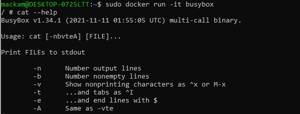

# Metodyki DevOps 2021/2022 NS
Zajęcia 02 - 2021-11-20
---
# Zestawienie środowiska
## 1. Instalacja Docker
Wykorzystywane środowisko to Debian na WSL2 - wymagało to również zainstalowania Docker Dekstop na windows, zgodnie z instrukcją: 
https://docs.docker.com/desktop/windows/wsl/

Zainstalowany Docker Desktop z integracją na WSL

Instalacja na środowisku linuksowym zgodnie z instrukcją:
https://docs.docker.com/engine/install/debian/

## 2. Rejestracja w Docker Hub

## 3. Pobierz hello-world, busybox, ubuntu

Do pobrania wykorzystuje się komendę: docker image pull, natomiast przy próbie uruchomienia nieistniejącego obrazu, Docke pobierze obraz automatycznie:

## 4. Busybox

Uruchomienie busybox 

Uruchomienie busybox interaktywnie i wywołanie numeru wersji

## 5. "system w kontenerze"

Uruchoemienie ubuntu

PID1 w kontenerze:

Procesy dockera na hoście:

Aktualizacja pakietów i wyjście z systemu:

## 6. Uruchomione kontenery

## 7. Czyszczenie obrazów

# Budowanie programu
