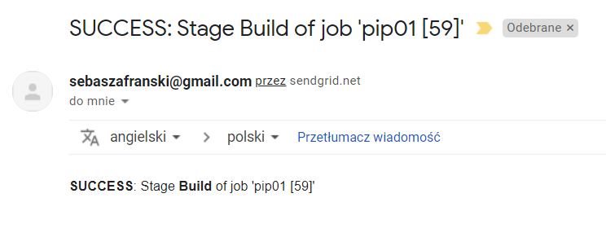

# Lab04

## Kilka rad zanim zaczniesz
- Niniejsza instrukcja zaklada prace pod systemem Windows z zainstalowanym WSL2
- Aby korzystac z docker'a pod WSL2 nalezy zainstalowac aplikacje [Docker Desktop for Windows ](https://hub.docker.com/editions/community/docker-ce-desktop-windows)
- W trakcie uzywania poleceń docker'a w kontenerach w pipeline'ach moze sie pojawic problem z samopodpisanymi certyfikatami
- Istnieje kilka rozwiązań tego problemu:
    - Podzielenie się samopodpisanym certyfikatem ze światem 
    - Wyłączenie weryfikacji z użyciem TLS-a **(wybrane przeze mnie)**
    - Dodanie insecure-registries do daemon.json

## Kroki

### Konfiguracja DIND 
Podczas uruchamiania kontenera DIND należy dodać poniższą opcje. \
`--env DOCKER_TLS_VERIFY=1` \
Pozwoli to **wyłączyć** weryfikacje z użyciem TLS-a i pozbyć się problemu z samopodpisanymi certyfikatami. 


### Stwórz Jenkinsfile: opis
1. Utwórz nowy pipeline budujący wybraną aplikację, oparty o Jenkinsfile
    - Z menu Jenkins'a wybieramy Nowy projekt i wybieramy typ Pipeline
    - W sekcji Pipeline wklejamy nasz skrypt [Jenkinsfile](https://github.com/InzynieriaOprogramowaniaAGH/MDO2022/blob/SS306505/GCL/03/SS306505/Jenkinsfile)
   
   
2. Może, ale nie musi, budować się na dedykowanym DIND, ale może się to dziać od razu na kontenerze CI. Należy udokumentować funkcjonalną różnicę między niniejszymi podejściami
    > **Budowanie następuje na kontenerze CI**
    > - Podejście to nie jest najlepsze, lecz najprostsze oraz najszybsze w implementacji
    > - Zastosowanie dedykowanego DIND pozwoliłoby na izolacje środowiska Jenkinsa i jego agenta
    > - Stosując dedykowany DIND uniknelibyśmy możliwych konfliktów wyeskponowanych portów

3. Początkowo, Jenkinsfile może być albo "wklejony" albo dodany do repozytorium, które jest sforkowane, to znaczy:
    - **albo pipeline zawiera treść Jenkinsfile'a** *(opisane w kroku 1)*
    - albo forkujemy repozytorium wybranej aplikacji i dodajemy Jenkinsfile do niego

    
### Jenkinsfile: przebieg
1. Przykładowe zbiory czynności w Jenkinsfile: Jednokrokowy pipeline (Build i test), pobierający narzędzie docker-compose i uruchamiajacy docker compose up na kompozycji z poprzednich zajęć
    - Aby uniknąć interakcji z menedżerem pakietów oraz problemów z brakiem uprawnień zrezygnowałem z instalacji docker-compose'a
    - Zamiast tego używam w Jenkinsfile-u komend dockerowych do budowania i uruchamianinia obrazów oraz powstałych z nich kontenerów

      
### Jenkinsfile: powiadomienia
1. Sekcja "post" dla każdego stage'a, informująca mailem o rezultacie
    > Rozwiązanie bazuje na znalezionym [tutorialu](https://www.youtube.com/watch?v=CGSwDpDfEMw) w którym użyto [Serwisu SMTP zapewnionego przez SendGrid](https://sendgrid.com/solutions/email-api/smtp-service/)
    
    |Krok|Opis|
    |-|-|
    |1|Należy najpierw skonfigurować serwer poczty|
    |2|Następnie ustawić potrzebne opcje (nazwa serwera smtp, dane do autentykacji, numer portu) w środowisku Jenkinsa (Manage Jenkins -> Configure System -> Extended E-mail Notification) |
    |3|W Jenkinsfile-u ustawić odbiorce, temat, zawartość maila oraz mime type|
    
    
    
    
### Jenkinsfile: deploy
1. W razie sukcesu, build ma zostać wypromowany jako kandydat do wydania
    - Kandydatem do wydania będzie kontener dockerowy
    - Miejscem publikacji będzie Docker Hub
2. Dopisany został produkcyjny Dockerfile. \
   Jego zadania to:
    - Ściągnięcie aplikacji
    - Instalacja produkcyjnych zależności
    - Uruchomienie samej aplikacji

    ```Dockerfile
    FROM node:16-alpine as builder

    WORKDIR /usr/app

    ENV NODE_ENV=production

    RUN apk update --quiet
    RUN apk add git --quiet
    RUN git clone https://github.com/scoquix/quick-example-of-testing-in-nodejs.git
    RUN cd /usr/app/quick-example-of-testing-in-nodejs && npm install --only=prod

    FROM node:16-alpine

    WORKDIR /usr/app

    COPY --from=builder /usr/app/quick-example-of-testing-in-nodejs ./

    CMD [ "npm", "start" ]
    ```

    
