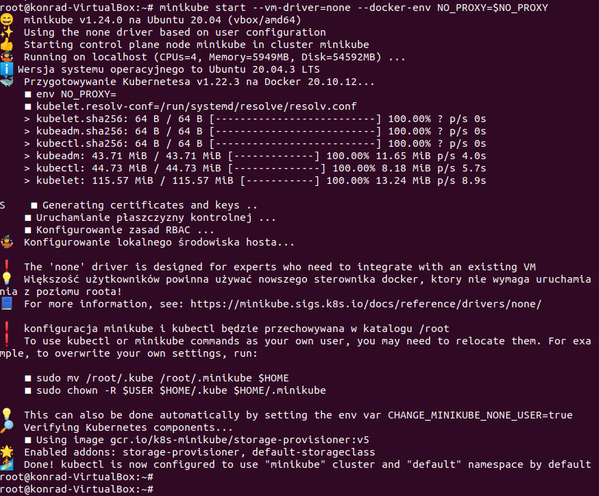

# Zajęcia 05

### Zestawienie platformy Kubernetes

* Upewnij się, że kontener jest dostępny
* Zainstaluj wymagania wstępne dla środowiska Minikube
* Zainstaluj minikube i kubectl
* 
* Przedstaw uruchomione oprogramowanie wstępne (i usługi)
  * Platforma konteneryzacji
  * Otwarte porty
  * Stan Dockera

### Stan Minikube
* Uruchom Minikube Dashboard
* Wyświetl działające usługi (k8s) i wdrożenia
* Wyświetl dostępne wdrożenia (stan "przed")

### Wdrożenie kontenera via k8s
* Wdróż przykładowy deployment "hello k8s": ```k8s.gcr.io/echoserver```
* Użyj ```kubectl run <ctr> --image=<DOCKER_ID>/ --port=<port> --labels app=ctr```
* Przekieruj porty
* Wykaż że wdrożenie nastąpiło
* W przypadku "niemożliwych" wdrożeń, opisz napotkane ograniczenia

### Deployment
* Utwórz plik YAML z "deploymentem" k8s
* Zestaw 4 repliki, opisz zalety i wady takiej liczby
* Zaaplikuj wdrożenie via ```kubectl apply -f plik.yml```
* Wykaż przeprowadzony deployment


